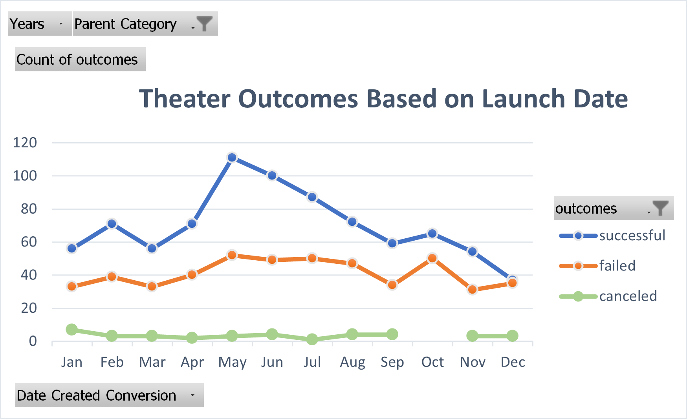

# Kickstarting with Excel

## Overview of Project

### Purpose

Analyze campaign results based on their launch dates and funding goals to help Louise 
understand how the relationship between these two factors works.

## Analysis and Challenges

### Analysis of Outcomes Based on Launch Dates 
    
- According to the analysis, May is the best month to launch a campaign 
since is the month with the best outcomes, both in number (166) and in percentage 
comparing it with the total launched campaigns  (67%).

- According to the analysis, December is the worst month to launch a campaign, 
since there are only 37 successful ones. campaigns representing 49% of the total campaigns 
that were launched during December.

   
### Analysis of Outcomes Based on Goals

- After creating our charts, we are able to notice that when a campaign is launched with a goal less than $1000,00
has more more chances to be succesful.

### Challenges and Difficulties Encountered

- Personally, I found myself a bit challenged while doing the "Outcomes Based on Goals" analysis 
since I don't have too much expertise with the "COUNTIFS" function in excel and also because there 
were more than 1 critiria to consider.

## Results

### What are two conclusions you can draw about the Outcomes based on Launch Date?

1.- Given that we are only analyzing the parent category "Theater" in general and not the behavior 
of each of its subcategories, we cannot delve further into this analysis.

2.- We know that May is the month with the most successful results, and it is also the month with more campaigns launched.
Therefore, there could probably be a correlation between the number of campaigns launched and the number of successful campaigns.

### What can you conclude about the Outcomes based on Goals?

- It seems that the higher the goals, the more failed results there will be.

### Limitations of the data set

- The Main limitation of the data set was that the columns "Date Created Conversion" and "Date Ended conversion"
were not in the right format to create pivot tables, pivot charts so we were not able to analyze data accurately.
Fortunately we solved this situation by doing the activities.

### What are some other possible tables and/or graphs that we could create?

- I would create another line chart by taking the data from "Theater Outcomes by Launch Date", but instead of
show the qty, show the percentage of successful, failed and canceled campaigns of the total of launched campaigns
of each month. Because with the chart we have created we can see how many successful campaigns there are but 
we don't know what the percentage is compared to the total.

